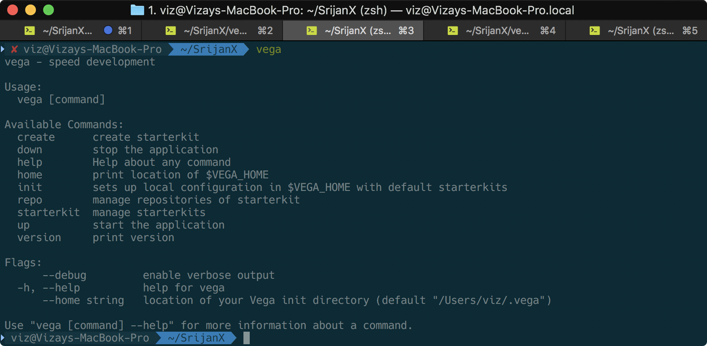
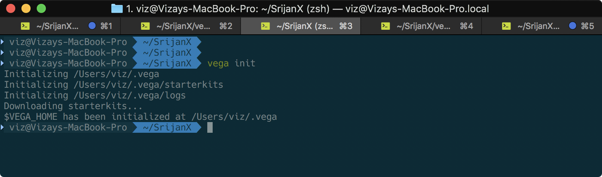
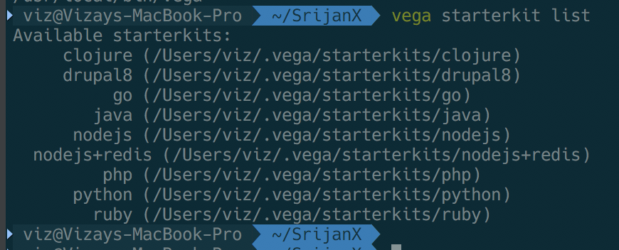
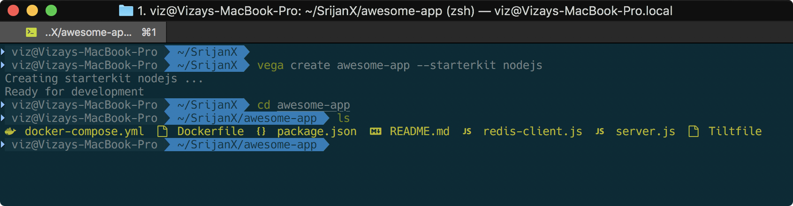
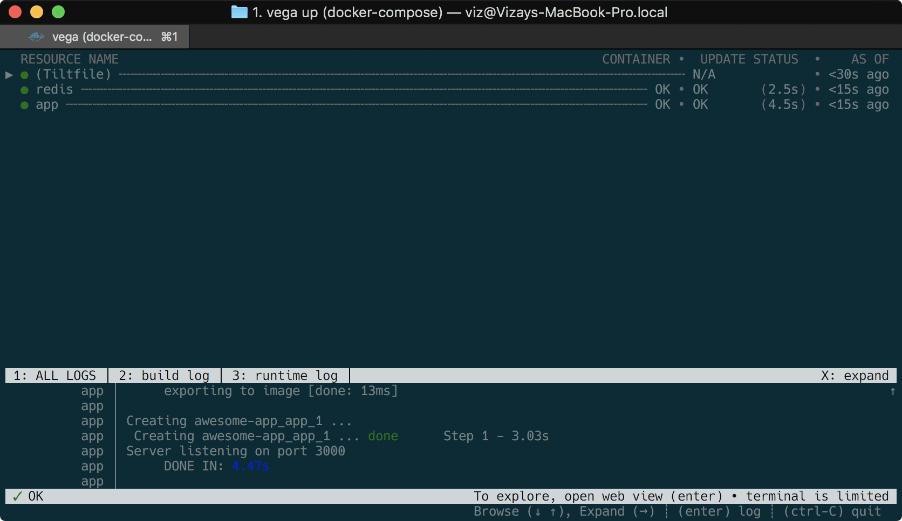

# Vega (वेग)

Vega (वेग) is developer friendly project scaffolding tool to speed up development process.

## Installation

Several options to install:

- Via **Installer Script**: `curl -fsSL https://raw.githubusercontent.com/srijanone/vega/develop/scripts/install.sh | bash`
- Via **Homebrew**: `brew install srijanone/vega/vega`
  - Update vega: `brew update && brew upgrade vega`
  - For Mac and Linux
- Via **Go**: `go install github.com/srijanone/vega`
  - (This might install latest unreleases/bleeding-edge version)
- Via released binaries:
  - [releases](https://github.com/srijanone/vega/releases)

---

## Requirements

- git
- [tilt](https://docs.tilt.dev/install.html)
- [Docker](https://docs.docker.com/install/)

---

## Getting Started

- `vega`: Vega usage

- `vega init`: Initializes vega

- `vega starterkit list`: List all available starterkits

- `vega create awesome-app --starterkit nodejs+redis`

- `vega up`

- `vega down`

---

## Commands

| Command                                      | Description                                                                           | Arguments                                       | Output     |
| -------------------------------------------- | ------------------------------------------------------------------------------------- | ----------------------------------------------- | ---------- |
| `vega`                                         | Prints out usage and help                                                             | \--home <path/to/home>                          |            |
| `vega version`                                 | Prints out version                                                                    |                                                 | Vega 1.0.0 |
| `vega home`                                    | Prints out home vega home                                                             |                                                 |            |
| `vega init`                                    | Initializes vega                                                                      |                                                 |            |
| `vega starterkit list`                         | List all available starterkits                                                        |                                                 | drupal8 nodejs    |
| `vega create [path] --starterkit <name>`       | Creates the starter kit at provided directory                                         | \--starterkit <name> \--repo <repo>          |            |
| `vega repo add <repo-name> <url>`              | Add another starterkit repo, Can choose local folder as well                          |                                                 |            |
| `vega repo list`                               | Lists all the repo available                                                          | \--repo <repo>                                  |            |
| `vega up`                                      | Runs the application                                                                  | \--port <log-port> \--watch \--no-browser |            |
| `vega down`                                    | Stops the application and deletes the resources                                       |                                                 |            |

#### Notes:
- All commands can take additional `--home` flag which will override default $VEGA_HOME
- `--repo` flag can take git url or local folder url
  - Examples:
    1. `vega repo add globe git@github.com:vs4vijay/vega-starterkits.git`
    2. `vega repo add new /Users/viz/SrijanX/custom`

---

## Development
`go run main.go`

- To Release Binaries: `goreleaser`
  - Github Token to be created and exported: `export GITHUB_TOKEN=<token>`

---

## Credits

- Srijan Team (https://srijan.net)
- Inspiration from Draft (https://draft.sh)
- Utilized Tilt (https://tilt.dev) for running the application 

---

## LICENSE

This software is covered under the Apache v2.0 license. You can read the [license here](LICENSE).

This software uses tilt binary, which is covered by the Apache v2.0 license too.