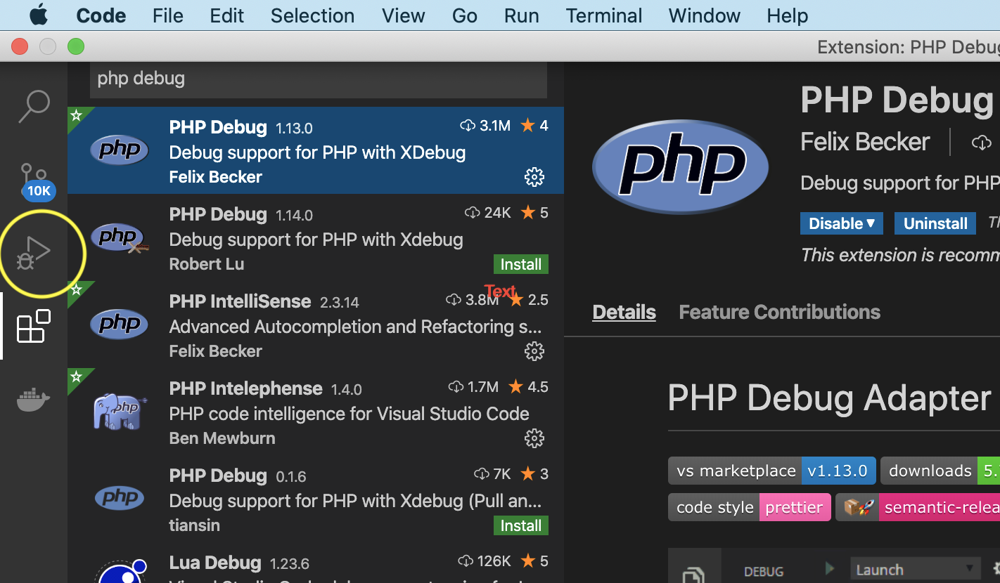
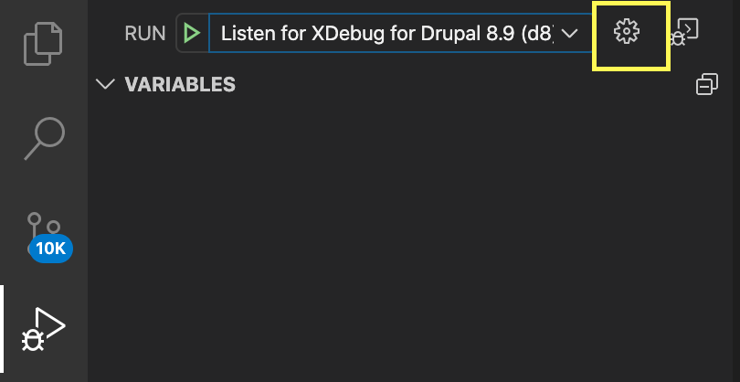
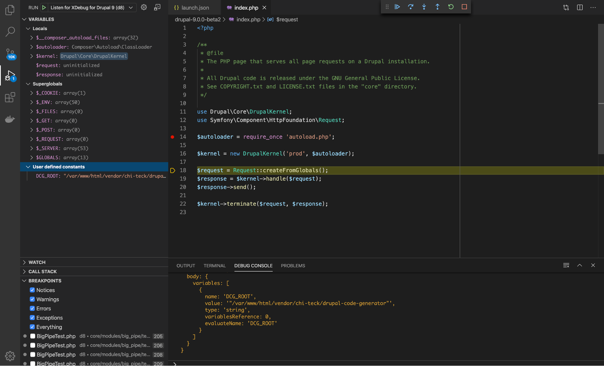

# XDebug Setup on VS Code with Docker PHP container

## Tasks to do inside VSCode.

- [Download VSCode Editor](https://code.visualstudio.com/download)
- [Configure VSCode for drupal development](https://www.drupal.org/docs/develop/development-tools/configuring-visual-studio-code)
- Install PHP debug extension if not installed as given in screen in previous step.
- Click the small bug icon on the lefthand sidebar.

  

- Check if .vscode/launch.json file is available in your vega project.
- If .vscode/launch.json file is not available follow next step.
- Click the small cog on the upper left side to open your IDE's launch.json file.


  


- Add below configuration in the launch.json.

  ```
  {
    "version": "0.2.0",
    "configurations": [
      {
        "name": "Listen for XDebug for Vega Applications.",
        "type": "php",
        "request": "launch",
        "port": 9001,
        "log": true,
        "pathMappings": {
          "/app": "${workspaceFolder}"
        }
      }
    ]
  }
  ```

  @NOTE: In the previous configurations in launch.json file:

  ```
  "pathMappings": {
    "/app": "${workspaceFolder}"
  }
  ```

  The left side key is the path of your docroot in the docker container (forex /app)
  The right side key is the path of code docroot in the VSCode (forex ~/Sites/your_project).

## Debugging the code

- Open any PHP file in VSCode.
- Add a breakpoint by clicking on the left side of the line. After adding in a breakpoint, you will see the red point on the line.
- Click on the bug icon on the left side of the VSCode toolbar. Select your configuration from the drop-down menu at the top.
- Open your script in the browser.
- Come back to the VSCode to see the live debugging.


  


- Use the palette visible in top right to step over, step in, step out, or continue and other options during debugging.
- Enjoy Debugging.
